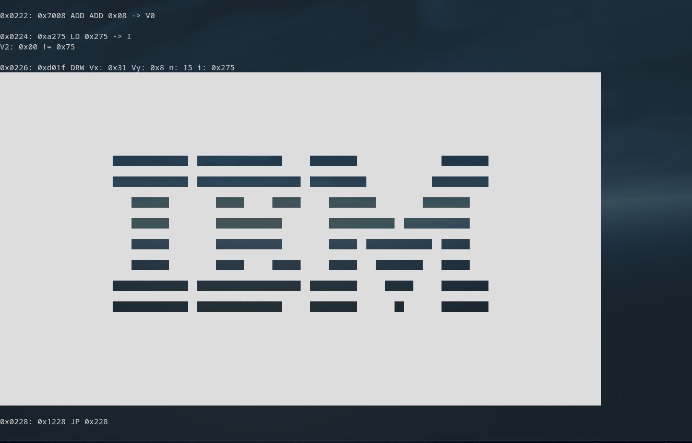

**This is still a work in progress**

To compile, either run the ``run.sh`` bash script, or use the ``make`` command.

Currently, the IBM test ROM, and the opcode test works! 

Lots of opcodes among other things are still broken/not implemented yet though. 

I also have not done graphics yet, I probably will use SDL to display them at some point, but I still need to learn how to do that. 

Right now, I'm just verifying the graphics work by printing them into the terminal.

# Resources used
[devernay](http://devernay.free.fr/hacks/chip8/C8TECH10.HTM)

[tobiasvl](https://tobiasvl.github.io/blog/write-a-chip-8-emulator/)

[austinmorlan](https://austinmorlan.com/posts/chip8_emulator/)

[codeslinger](http://www.codeslinger.co.uk/pages/projects/chip8.html)

[multigesture](https://multigesture.net/articles/how-to-write-an-emulator-chip-8-interpreter/)

[w&jdevschool](https://blog.wjdevschool.com/blog/video-game-console-emulator/)

[test-rom](https://github.com/corax89/chip8-test-rom)

