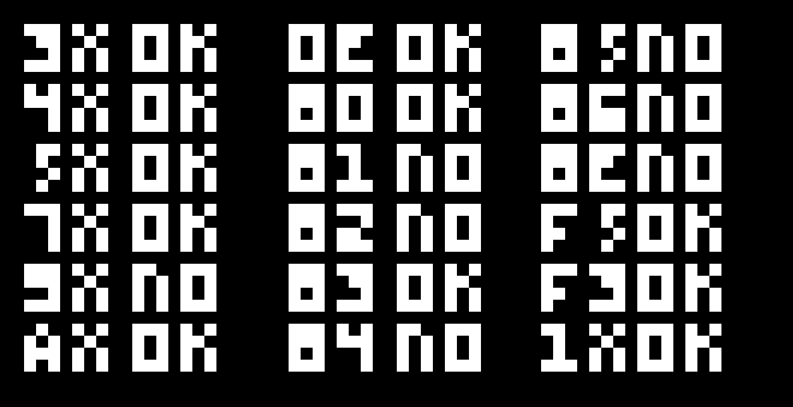
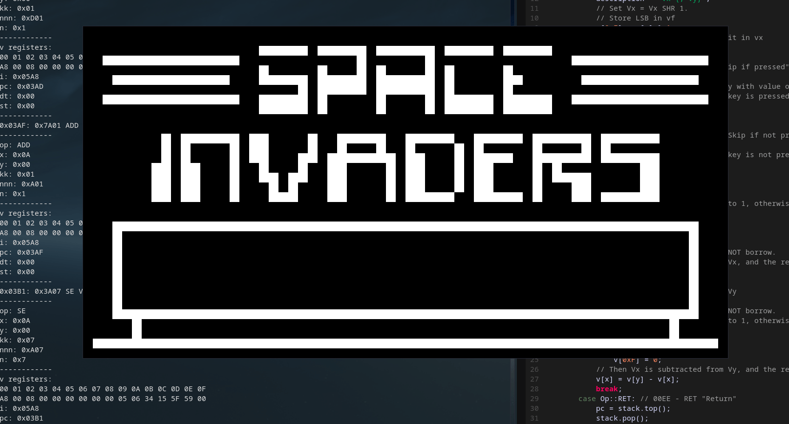
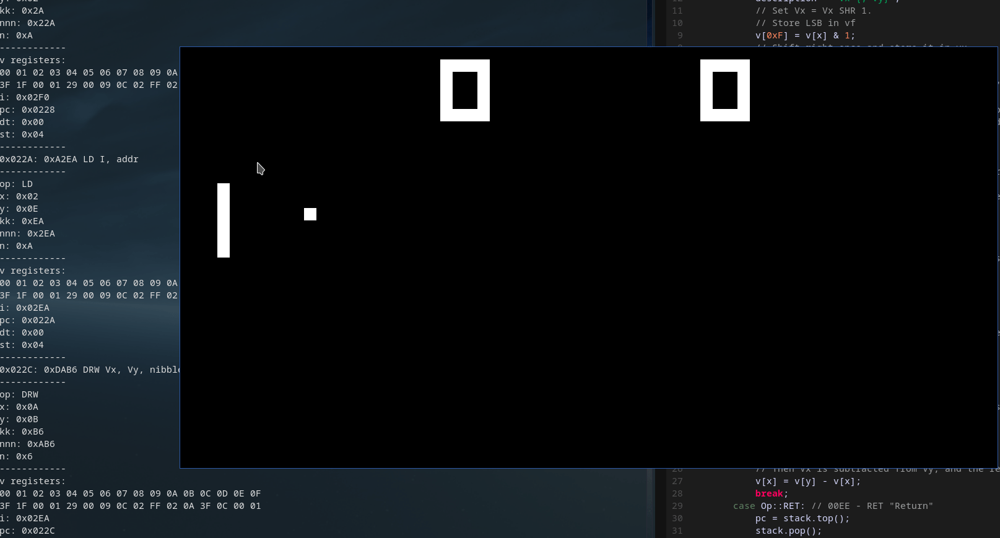
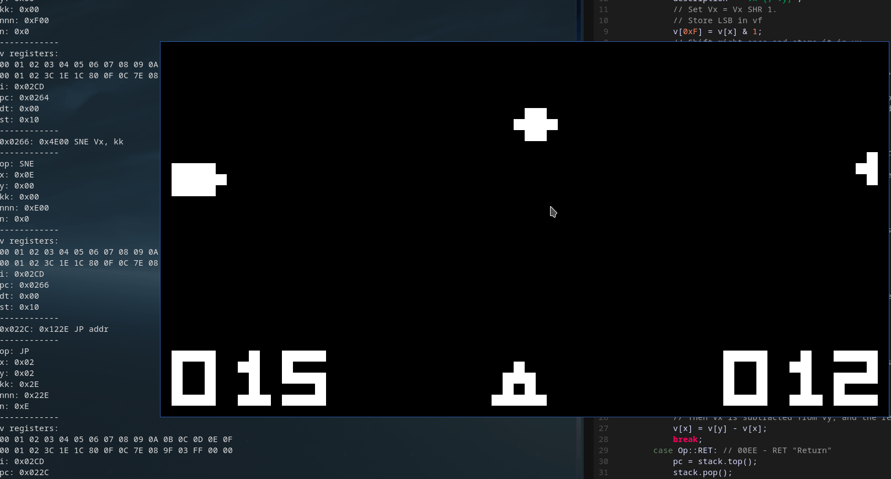

# Issues
Timing is broken on some games, and input is awkward on games that wait for input (i.e. Tetris)

Flickering exists due to the inherent way the CHIP-8 displays graphics. Reducing the flickering will deviate from true emulator
accuracy, but it would look more presentable.

Sound is not implemented

Most games almost fully work, but not all.

# How to use

If you are on Linux, you will have to compile this from source. I used the SDL 2.0 libraries to render graphics, so you will need those libraries installed for your respective distro.

If you are on Windows, the binary files are provided in the ``Windows`` directory. If you wish to compile this from source, you will need to figure out how to download the SDL 2.0 libraries on Windows. For more details, you can view my [TetriC README](https://github.com/hosua/TetriC#compiling-on-windows) on how to install the SDL 2.0 libraries on Windows. 

Simply run ``./CHIP8`` if running on Linux, or run ``CHIP8.exe`` on Windows.

For extra debugging commands, run ``./CHIP8 --help``. (Windows users can do this by running ``./CHIP8.exe --help`` in CMD or powerhell)

# Resources used
[devernay](http://devernay.free.fr/hacks/chip8/C8TECH10.HTM)

[tobiasvl](https://tobiasvl.github.io/blog/write-a-chip-8-emulator/)

[codeslinger](http://www.codeslinger.co.uk/pages/projects/chip8.html)

[multigesture](https://multigesture.net/articles/how-to-write-an-emulator-chip-8-interpreter/)

[w&jdevschool](https://blog.wjdevschool.com/blog/video-game-console-emulator/)

[test-rom](https://github.com/corax89/chip8-test-rom)

