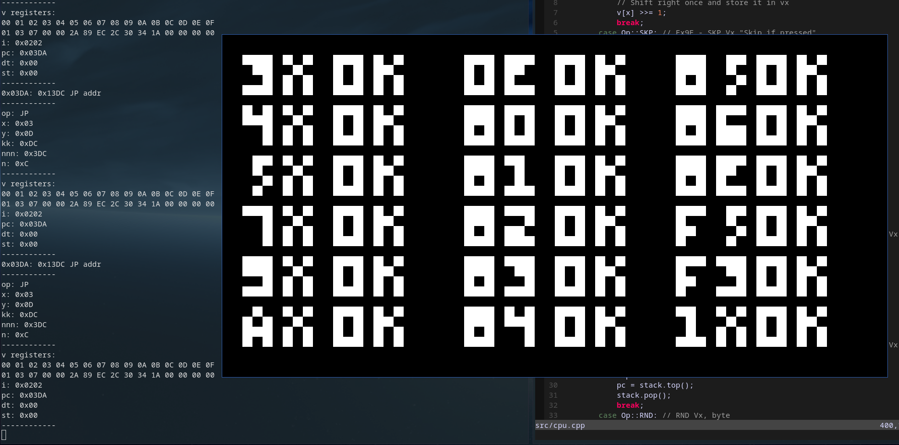

**This is still a work in progress**

# Issues
Timing is broken

Some games partially work right now, but most don't.

Some opcodes are still broken/not implemented yet.


# How to use

If you do wish to use this currently broken emulator...

From the ``run.sh`` script help menu:
```
-c Compile Chip8 with make
-d Delete all build files (including executable) with make clean
-y Compile with compiledb script for YCM syntax completion/checking
-k Force kill CHIP8
-t Run test ROM
-h This help menu
```

You must compile the program with the ``-c`` flag first for it to work.

If you run this script without arguments, it will let you select a game from the ``games`` directory and run the CHIP8 emulator. It will also perform the selection if it detects a compiled copy of the CHIP8 in the directory

If you cannot use the ``run.sh`` script for whatever reason, you can compile the program with ``make``,
and then run it with ``./CHIP8 "games/IBM"``, to run the IBM test ROM for example.

To render the graphics, I am using SDL 2.0.




# Resources used
[devernay](http://devernay.free.fr/hacks/chip8/C8TECH10.HTM)

[tobiasvl](https://tobiasvl.github.io/blog/write-a-chip-8-emulator/)

[austinmorlan](https://austinmorlan.com/posts/chip8_emulator/)

[codeslinger](http://www.codeslinger.co.uk/pages/projects/chip8.html)

[multigesture](https://multigesture.net/articles/how-to-write-an-emulator-chip-8-interpreter/)

[w&jdevschool](https://blog.wjdevschool.com/blog/video-game-console-emulator/)

[test-rom](https://github.com/corax89/chip8-test-rom)


